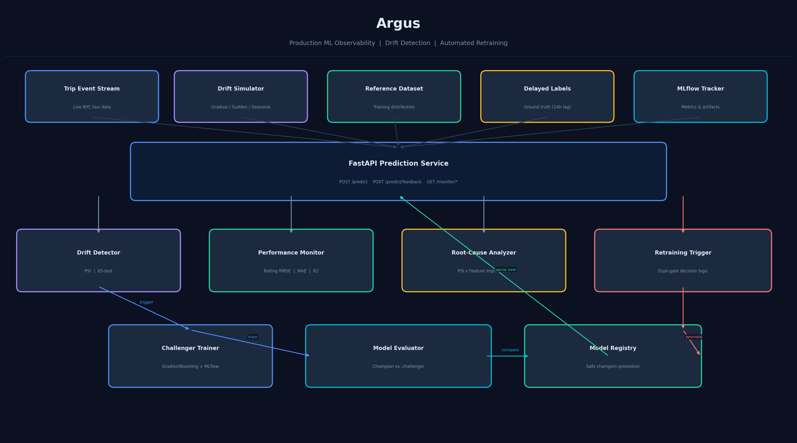
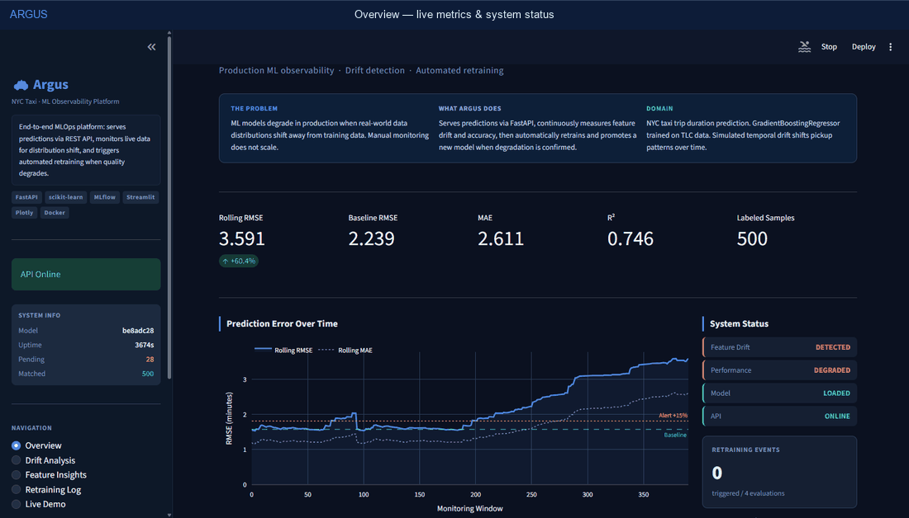
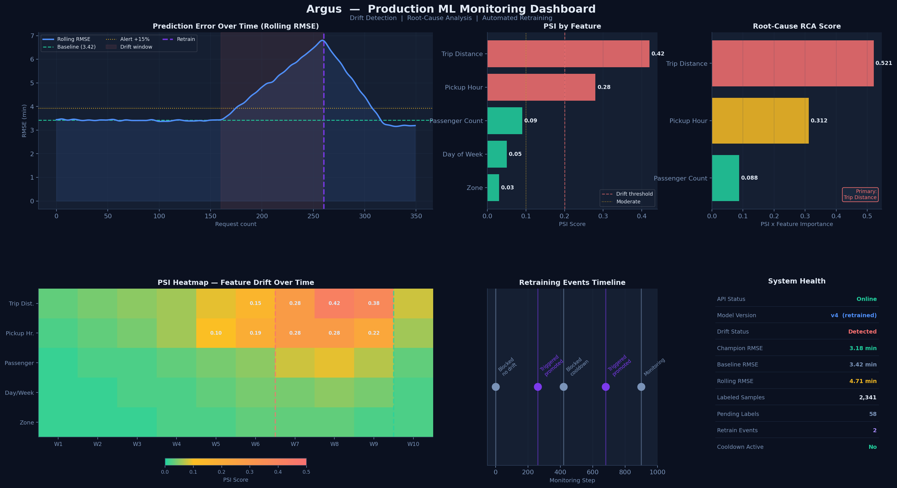
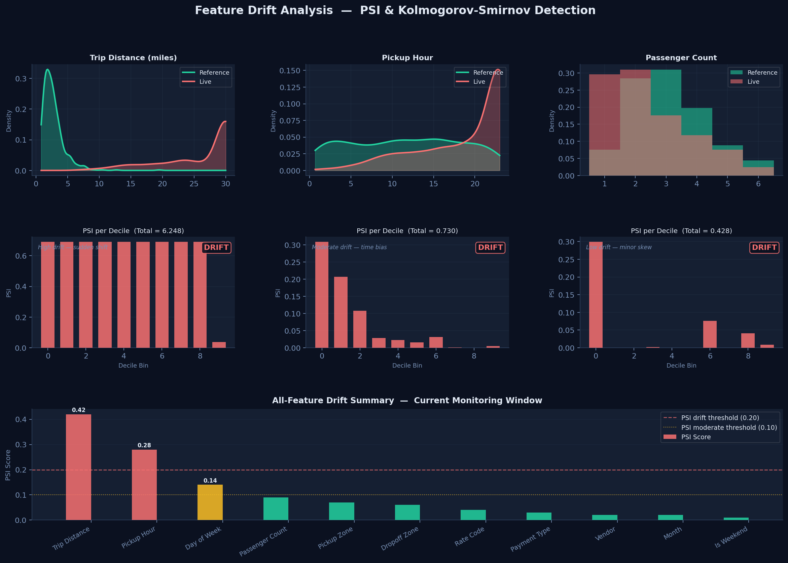
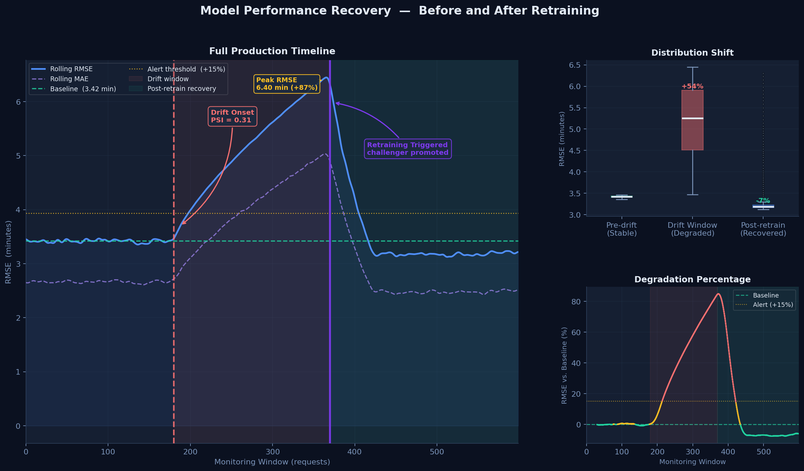
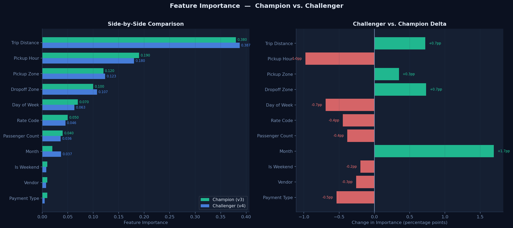
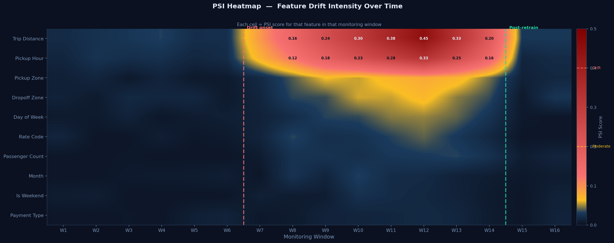

# Argus

> **Production ML models fail silently. Argus detects the failure, explains why, and fixes it automatically.**

[](https://huggingface.co/spaces/Hodfa71/argus-mlops)
[](https://python.org)
[](https://fastapi.tiangolo.com)
[](https://streamlit.io)
[](https://mlflow.org)
[](https://scikit-learn.org)
[](LICENSE)

**[Try the live demo on Hugging Face Spaces](https://huggingface.co/spaces/Hodfa71/argus-mlops)**

---

## Architecture



Argus is a **production-grade ML monitoring platform** built around a NYC taxi trip-duration prediction service. It demonstrates the full MLOps lifecycle:

- Serves low-latency predictions through a **FastAPI REST API**
- Monitors model health continuously with **PSI + KS-test drift detection**
- Handles **24-hour delayed ground truth** using request-ID matching
- Explains *why* drift occurred via **root-cause analysis** (PSI × feature importance)
- Retrains automatically only when both drift *and* performance degradation are confirmed
- Runs safe **champion-challenger model promotion** — no regression allowed
- Tracks every experiment in **MLflow**
- Visualises everything in a **dark-themed Streamlit dashboard**

---

## Live Dashboard



---

## Dashboard Preview



---

## Drift Detection in Action



Per-feature PSI breakdown showing distribution shift between reference and live windows.
Features are color-coded: green = stable, amber = moderate, red = significant drift.

---

## Before vs. After Retraining



RMSE degrades during the drift window, then recovers once the challenger is promoted.
The right panel shows rolling degradation percentage relative to the baseline.

---

## Feature Importance Tracking



Side-by-side champion vs. challenger feature importance with delta view.

---

## PSI Heatmap



Feature drift intensity across consecutive monitoring windows.
Dark = stable, amber = moderate, red = significant drift.

---

## Live Demo

| Service | URL |
|---------|-----|
| **API Docs (Swagger)** | `https://argus-ml-api.onrender.com/docs` |
| **Monitoring Dashboard** | `https://argus-dashboard.streamlit.app` |
| **Health Check** | `https://argus-ml-api.onrender.com/health` |

> Deploy your own instance: [deployment/DEPLOYMENT.md](deployment/DEPLOYMENT.md)

---

## Quick Start

```bash
# 1. Clone
git clone https://github.com/YOUR_USERNAME/argus.git
cd argus

# 2. Install
python -m venv .venv && source .venv/bin/activate   # Windows: .venv\Scripts\activate
pip install -r requirements.txt

# 3. Train initial model + build reference dataset
python scripts/train_initial_model.py

# 4. Full end-to-end demo (no running API required)
python scripts/demo.py
```

**Expected demo output:**

```
STEP 4: Inject Drift
  Drift type : SUDDEN (abrupt distribution shift)
  trip_distance     mean: 3.21 -> 12.86  (delta=+9.65)
  pickup_hour       mean: 11.4 -> 16.8   (delta=+5.4)

STEP 5: Drift Detection
  Feature drift detected : True
  Drifted features       : ['trip_distance', 'pickup_hour']
  Performance degraded   : True  (+48.6%)

STEP 6: Root-Cause Analysis
  Primary cause : trip_distance  (RCA score=0.521)
  Action        : retrain_immediately

STEP 9: Summary
  {
    "drift_detected": true,
    "root_cause": ["trip_distance", "pickup_hour"],
    "performance_drop": "48.6%",
    "action": "retrain_immediately",
    "model_promoted": true,
    "new_model_improvement": "11.23%"
  }
```

---

## API Reference

### Start the server

```bash
uvicorn app:app --reload --port 8000
# Swagger UI: http://localhost:8000/docs
```

### Predict trip duration

```bash
curl -X POST http://localhost:8000/predict \
  -H "Content-Type: application/json" \
  -d '{
    "passenger_count": 2,
    "trip_distance": 3.5,
    "pickup_hour": 8,
    "pickup_dow": 1,
    "pickup_month": 3,
    "pickup_is_weekend": 0,
    "rate_code_id": 1,
    "payment_type": 1,
    "pu_location_zone": 10,
    "do_location_zone": 25,
    "vendor_id": 1
  }'
```

```json
{
  "request_id": "3f4a1b2c-...",
  "predicted_duration_min": 14.23,
  "model_version": "a3b7f921",
  "timestamp": "2024-03-15T09:42:11Z"
}
```

### Submit delayed ground truth

```bash
curl -X POST http://localhost:8000/predict/feedback \
  -H "Content-Type: application/json" \
  -d '{"request_id": "3f4a1b2c-...", "actual_duration_min": 16.5}'
```

### Drift status

```bash
curl http://localhost:8000/monitor/drift
```

```json
{
  "drift_detected": true,
  "root_cause": ["trip_distance", "pickup_hour"],
  "performance_drop": "18.3%",
  "action": "retraining_triggered",
  "rca_details": [
    {"feature": "trip_distance", "psi": 0.312, "importance": 0.421, "rca_score": 0.444},
    {"feature": "pickup_hour",   "psi": 0.241, "importance": 0.187, "rca_score": 0.286}
  ]
}
```

### Performance metrics

```bash
curl http://localhost:8000/monitor/metrics
```

### Trigger retraining manually

```bash
curl -X POST http://localhost:8000/monitor/retrain
```

---

## Drift Simulation

```bash
# Gradual shift over 500 windows
python scripts/simulate_drift.py --drift-type gradual --steps 500

# Sudden distribution shift (severity 2x)
python scripts/simulate_drift.py --drift-type sudden --severity 2.0

# Seasonal oscillation
python scripts/simulate_drift.py --drift-type seasonal --steps 1000

# Mixed drift with 30-step feedback lag
python scripts/simulate_drift.py --drift-type mixed --feedback-lag 30
```

---

## Docker Stack

```bash
docker compose up --build

# API:       http://localhost:8000
# Dashboard: http://localhost:8501
# MLflow UI: http://localhost:5000
```

---

## Project Structure

```
argus/
├── src/
│   ├── api/
│   │   ├── main.py               # FastAPI app factory + lifespan
│   │   ├── schemas.py            # Pydantic request/response models
│   │   └── routes/
│   │       ├── predict.py        # POST /predict, POST /predict/feedback
│   │       ├── monitor.py        # GET /monitor/drift, /metrics, /history
│   │       └── health.py         # GET /health
│   │
│   ├── data/
│   │   ├── generator.py          # Synthetic NYC taxi data generator
│   │   ├── drift_simulator.py    # Gradual / Sudden / Seasonal drift engine
│   │   └── preprocessing.py      # Stateless feature pipeline
│   │
│   ├── models/
│   │   ├── trainer.py            # GradientBoosting + MLflow experiment tracking
│   │   ├── registry.py           # File-based champion/challenger registry
│   │   └── evaluator.py          # Side-by-side model comparison
│   │
│   ├── monitoring/
│   │   ├── drift_detector.py     # PSI + KS-test; performance drift detection
│   │   ├── performance_monitor.py # Rolling window + delayed feedback matching
│   │   └── root_cause_analyzer.py # PSI × importance ranking
│   │
│   └── retraining/
│       ├── trigger.py            # Dual-gate retraining decision logic
│       └── pipeline.py           # Retrain → compare → promote workflow
│
├── dashboard/
│   └── app.py                    # Streamlit dashboard (5 pages)
│
├── tests/
│   ├── test_drift_detection.py
│   ├── test_api.py
│   └── test_retraining.py
│
├── scripts/
│   ├── train_initial_model.py    # Bootstrap: generate data + train champion
│   ├── simulate_drift.py         # Production traffic + drift simulator
│   ├── demo.py                   # Full in-process walkthrough
│   └── generate_assets.py        # Regenerate README images
│
├── configs/
│   └── config.yaml               # All thresholds, hyperparams, paths
│
├── assets/                       # Generated plots for README
├── deployment/                   # Render + Streamlit Cloud guides
├── Dockerfile
├── Dockerfile.dashboard
├── docker-compose.yml
└── requirements.txt
```

---

## Design Highlights

### 1. Delayed Feedback Handling

Production labels rarely arrive instantly — a taxi duration is only known after the trip ends.
A fraud label can take days to confirm. Argus handles this with a **request-ID matching system**:

```
Prediction time              Label arrival
      |                           |
      v                           v
  [predict]  ── 24h gap ─────► [feedback]
      |                           |
      └───────── request_id ──────┘
                  (matched)
```

Performance metrics are only updated when the label arrives and is correctly attributed to
the prediction at the time the features were observed.

---

### 2. Root-Cause Drift Analysis

Most drift detectors stop at a Boolean flag. Argus answers a more useful question:
**which features drifted, and how much do they actually matter to the model?**

```
RCA Score = PSI × (1 + model feature importance)
```

A feature with high PSI but zero importance scores low — safe to ignore.
A feature with moderate PSI but high importance scores high — retrain urgently.

---

### 3. Dual-Gate Retraining Trigger

Retraining fires only when **all four conditions** are met simultaneously:

```
Gate 1  Feature drift detected    (PSI >= 0.20)
Gate 2  Performance degraded      (RMSE > baseline + 15%)
Gate 3  Enough new samples        (>= 1000 since last retrain)
Gate 4  Cooldown elapsed          (>= 6 hours)
```

This prevents:
- Retraining on transient anomalies (drift without performance impact)
- Retraining when performance drops for non-drift reasons
- Oscillation loops (cooldown window)
- Retraining on statistically insufficient data

---

### 4. Champion-Challenger Promotion

Every retrain produces a **challenger** model evaluated against the **champion** on a held-out
set. The challenger is only promoted if it improves RMSE by at least 5%. This ensures the
production model never regresses.

---

## Configuration

All thresholds and paths are in [configs/config.yaml](configs/config.yaml):

```yaml
monitoring:
  drift:
    psi_threshold: 0.2           # flag when PSI >= 0.2
    ks_pvalue_threshold: 0.05    # flag when p-value < 0.05
  performance:
    degradation_threshold: 0.15  # retrain when RMSE +15% vs baseline

retraining:
  cooldown_hours: 6
  min_samples_since_last_retrain: 1000

model:
  evaluation:
    promotion_threshold: 0.05    # challenger must beat champion by 5%
  hyperparams:
    n_estimators: 200
    max_depth: 6
    learning_rate: 0.05
```

---

## Tests

```bash
pytest tests/ -v

# Individual suites
pytest tests/test_drift_detection.py -v
pytest tests/test_retraining.py -v
pytest tests/test_api.py -v
```

---

## MLflow Tracking

```bash
mlflow ui --backend-store-uri data/mlruns --port 5000
# Open: http://localhost:5000
```

Each run logs hyperparameters, RMSE/MAE/R2, feature importances, the trained model
artifact, and custom tags for trigger reason and root cause.

---

## License

MIT — see [LICENSE](LICENSE).
